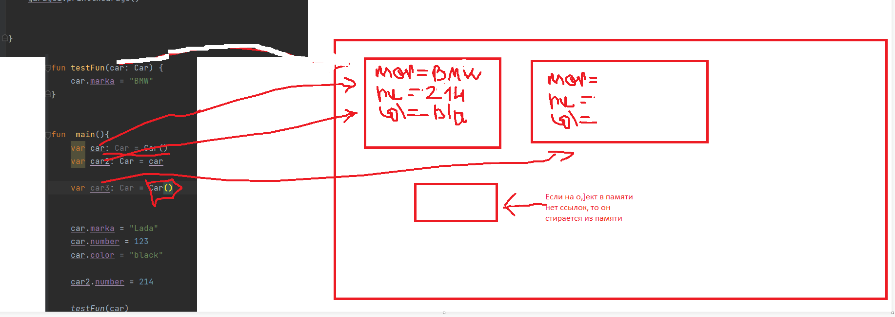

## KOTLIN
Объявление переменной - это указание зарезервированных слов val или var, указание имени и тип переменной.

Объявленная переменная до инициализации ничего в себе не хранит.

Конструкция: 
```
val/var <имя переменной>: <тип переменной>
```
Пример:
```
val cat: String
var age: Int
```
Val - это константа, т.е. не изменяется в дальнейшем. Её сразу нужно инициализировать.  
Var - это переменная.

Инициализация - это первое присвоение переменной (константе) значения.

Конструкция:
```
<имя переменной> = <значение>
```
Пример:
```
cat = "Evgen"
age = 21
```
Объявление и инициализация можно делаеть в одной строке:

Пример:
```
val cat: String = "Evgen"
var age: Int = 21
```

## Function 
Функция - это набор инструкции заключенный в блоке кода, который мы можем вызывать по имени и передавать туда данные, обрабатывать их там, возвращать или нет.

Синтаксис описание функции:
```
fun имя_функции (параметры) : возвращаемый_тип{
    выполняемые инструкции
    
    return (данные которые соответствуют возвращаемому типу)
}
```
Синтаксис описания функции без возвращаемого значения:
```
fun имя_функции (параметры) {
    выполняемые инструкции   
}
```
Синтаксис вызова функции с возвращаемым значением:
```
var имя_переменной: тип_возвращаемого_значения_функции = имя_функции(парамметры)
```
Замечение:

>При вызове функции с возвращаемым значением в месте вызова функции, после ее отработки, будет заменено на данные типа, которого она возвращает 

Синтаксис вызова функции без возвращаемого значения:
```
имя_функции(парамметры)
```
Парраметры функции существуют в области видимости этой функции:
```
fun test (a: Int){
    инструкции
}
```
Переменная а будет существовать в памяти в пределах области видимости {}

#Class
Класс - представляет собой шаблон для создания объектов, обеспечивающий начальные значения состояний: инициализация полей-переменных и реализация поведения функций или методов

Пример:
```
class Car(){
val number: Int = 12
val color: String = red

fun printlnCar(){
println("number: $number cokolor: $color")
} 

}
```
# Строковые шаблоны

Строковые шаблоны - участки кода, которые выполняются, а полученный результат встраивается в строку

Синтаксис:
```
println("${код}")
```

Пример:
```
println("ssd == 512 ? ${if (ssd.size == 512){"yes"} else {"no"}}")
```
# Композиция
Композиция - это, когда класс полностью контролирует жизненый цикл своих свойств.

# Агрегация
Агрегация - это, когда не контролирует жизненный цикл свойств.

## Перегрузка методов

Перезрузка методов - это несколько функции с одним и тим же именем, но с разными типами, количествами и порядками пармамметров.

Имя парамметра не имеет значение
### Пример по типпу данных

Если хотя бы одна переменная отличается по типу данных, то это уже перегрузка функций
```
fun sum(a: Int, b: Int) : Int{
    return a + b
}
fun sum(a: Double, b: Double) : Double{
    return a + b
}
```
### Пример по количеству парамметров
```
fun sum(a: Int, b: Int, c: Int) : Int{
    return a + b + c
}
fun sum(a: Int, b: Double) : Double{
    return a + b
}
```
### Пример по порядку  
```
fun sum (a: Int, b: Double): Int{
    return a + b
}
fun sum (b: Double, a: Int): Int{
    return b + a 
}
```
### Конструктор 

Конструктор - это ОСОБЕННАЯ функция, которая нужна для создания обьекта класса - выделение памяти, инициализации свойсв обьектов и возвращение ссылки на этот обьект.
Конструктор пишется в классе.

### Пример
```
class User {
    private var name: String
    private var lastName: String
    public var computers: Array<Computer>

    constructor(_name: String, _lastName: String, _computers: Array<Computer>){
        this.name = _name
        this.lastName = _lastName
        this.computers = _computers
    }  
}
```
Конструктор может быть без парамметров. Тогда нам нужно его инициализировать значениями по умолчанию в конструкторе.

```
class User {
    private var name: String
    private var lastName: String
    public var computers: Array<Computer>

    constructor(){
        this.name = "evgen"
        this.lastName = "ecstaz"
        this.computers = arrayOf(Computer(), Computer())
    }  
}
```
### Get
```
Get - это метод получение элемента их структуры жжаных
```
Пример массив
```
a.get(i)
```
### Set
Set - это метод установки элемента в конкретном месте

Пример массив
```
a.set(i, value)
```

## Массивы
Массив -  это упорядоченный набор (коллекция) однотипных объектов, размещаемых в едином блоке памяти последовательно друг за другом

Пример:
```
val number: IntArray = intarrayOf(1, 3, 4, 8)
```
Пример вывода массива:
```
for (i in 0 until array.size) {
        println(array[i])
    }
    
for (i in 0 until array.size) {
        print("${array[i]} ")
    }
```
Двумерный (многомерный) массив - это массив, каждый элемент которого в свою очередь сам является массивом

Пример:
```
fun main() {
    val table: Array<Array<Int>> = Array(2,{Array(2, {0})})
    for (i in 0 until table.size ) {
        for (j in 0 until table.get(i).size){
            print(table[i][j])
        }
    }
}
```

Методы массива:
https://kotlinlang.org/api/latest/jvm/stdlib/kotlin/-array/

Пример метод итератор
```
fun main(){
    var nums: IntArray = intArrayOf(1, 2, 5)
    var iter: Iterator<Int> = nums.iterator()
    while (iter.hasNext()) {
        println(iter.next())
    }
```


## ObjectInMemmory


